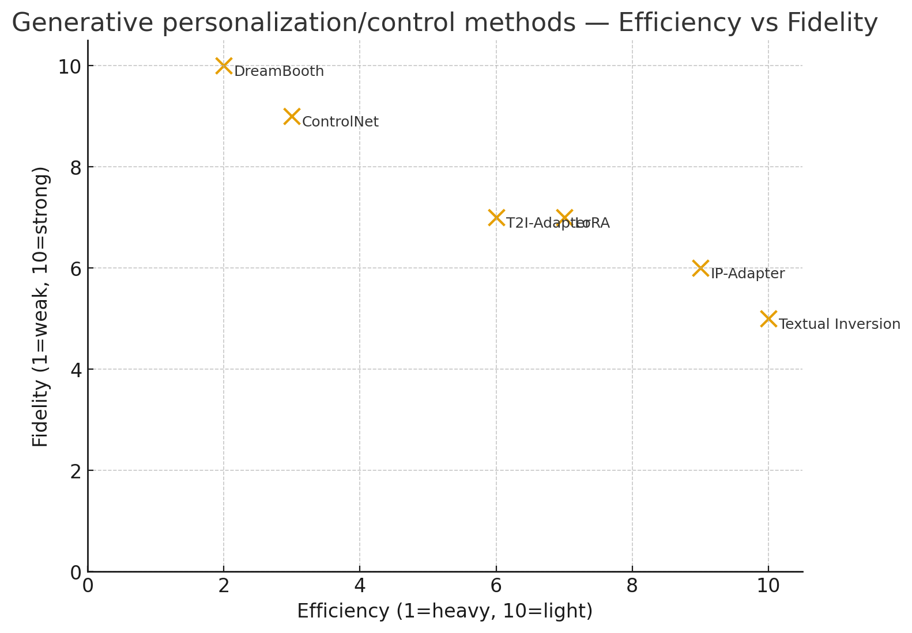

# Personalization and Control Methods for Diffusion Models

This document explains and compares six key techniques for **controlling or personalizing diffusion models** such as Stable Diffusion.

---

## 🔹 1. LoRA (Low-Rank Adaptation)

- Fine-tunes models with **low-rank matrices** instead of updating all weights.
- **What it is:** A fine-tuning method where instead of updating all model weights, you inject small trainable low-rank matrices into certain layers (e.g., attention, linear layers).

- **Why:** Greatly reduces trainable parameters → smaller, faster training, easier to distribute.

- **Use cases:** Personalization (style transfer, fine-tuning for a new dataset) without retraining the whole model.
- **Pros:** Lightweight, modular, can combine multiple LoRAs.
- **Cons:** Requires some training, risk of overfitting.

---

## 🔹 2. IP-Adapter

- Adds an **image-conditioning adapter** to diffusion models.  
- **What it is:** An adapter module for diffusion models that allows image-prompt conditioning. You provide a reference image, and the adapter aligns its features with the diffusion process.

- **Why:** Enables image-based guidance (style transfer, face preservation, consistent character rendering).

- **Use cases:** Keep identity/style from a reference image while generating variations.

- **Pros:** Fast, plug-and-play, no re-training needed for each new reference. captures style/identity from images.  

- **Cons:** Less precise than full fine-tuning; quality depends on adapter training.

---

## 🔹 3. ControlNet

- Provides **structural conditioning** (pose, depth, edge maps).  
- **What it is:** A method to give structural control signals (like edge maps, pose skeletons, depth maps) to diffusion models.

- **Why:** Original diffusion models follow text prompts loosely; ControlNet locks in geometry/structure.

- **Use cases:** Pose-guided generation, sketch-to-image, depth-aware rendering.

- **Pros:** Very strong structure control. Fine-grained structural control, supports multiple input types.

- **Cons:** Heavier model (doubles parameters), each control type needs its own trained ControlNet.

---

## 🔹 4. T2I-Adapter

- Lightweight alternative to ControlNet using smaller adapters.  
- **What it is:** A lighter version of ControlNet. Instead of duplicating the whole U-Net, it uses a small adapter module to inject control signals (e.g., canny edges, segmentation, depth).

- **Why:** Makes control cheaper and faster.

- **Use cases:** Similar to ControlNet (sketch-to-image, pose-to-image) but more resource-friendly.

- **Pros:** Lightweight, efficient, flexible, resource-friendly, easy to switch controls.

- **Cons:** Slightly weaker control fidelity than ControlNet.

---

## 🔹 5. DreamBooth

- Fine-tunes a diffusion model with images of a subject, linked to a **unique token**.  

- **What it is:** A personalization method where you fine-tune a diffusion model with a few images of a subject (person, object, pet), associating them with a unique token.

- **Why:** Lets you generate that subject in new contexts (e.g., your dog as an astronaut).

- **Use cases:** Character identity preservation, personalized avatars.

- **Pros:** Very accurate identity capture. High-fidelity identity preservation.

- **Cons:** Heavy (updates whole model), needs several images, risk of overfitting or “model forgetting.”

---

## 🔹 6. Textual Inversion

- Trains **new token embeddings** to represent objects/styles.  
- **What it is:** Instead of fine-tuning the whole model, you learn new word embeddings for a unique concept (e.g., a person, style).

- **Why:** Lightweight (just a vector), injects new concepts into the existing model vocabulary.

- **Use cases:** Capture styles or objects from few images, share as small embedding files.

- **Pros:** Ultra-lightweight (just a vector), easy to share, fast training.

- **Cons:** Limited fidelity; struggles with exact identities (better for styles/objects than people).

---

## 📊 Comparison Table

| Technique          | Type of Adaptation   | Data Needed | Training Cost | Size | Strengths | Weaknesses |
|--------------------|----------------------|-------------|---------------|------|------------|-------------|
| **LoRA**           | Weight adaptation    | Few–medium  | Low–medium    | Small (MBs) | Modular, efficient fine-tuning | Needs training |
| **IP-Adapter**     | Image prompt adapter | None        | None (inference only) | Medium | Easy conditioning | Less precise |
| **ControlNet**     | Structure conditioning | None (maps) | Pretrained    | Large | Strong control | Heavy |
| **T2I-Adapter**    | Lightweight control  | None (maps) | Pretrained    | Small | Cheap, flexible | Less control strength |
| **DreamBooth**     | Full fine-tuning     | Few images  | High          | Large (GBs) | Strong fidelity | Heavy, overfits |
| **Textual Inversion** | Token embedding    | Few images  | Very low      | Tiny (KBs) | Shareable, lightweight | Limited fidelity |

---

## 🎯 Trade-off Visualization

Below is a **scatter plot** showing relative positions of these methods in terms of **efficiency vs fidelity**.

- **X-axis = Efficiency (higher = lighter/faster).**  
- **Y-axis = Fidelity (higher = better preservation/control).**  

- The table shows approximate relative scores for efficiency (how lightweight/fast the method is) and fidelity (how well it preserves identity/style/structure).

- The scatter plot maps them so you can see trade-offs:

    - DreamBooth = highest fidelity but heavy.

    - Textual Inversion = ultra-lightweight but limited fidelity.

    - LoRA = balanced middle ground.

    - ControlNet = strong fidelity for structure, but heavy.

    - T2I-Adapter = lighter ControlNet.

    - IP-Adapter = lightweight, flexible, but weaker fidelity than fine-tuning.
---

## 🔑 Key Insights
- **DreamBooth** achieves the best fidelity, but is very heavy.  
- **Textual Inversion** is ultra-efficient, but fidelity is limited.  
- **LoRA** balances efficiency and fidelity.  
- **ControlNet** gives structural control but is heavy, while **T2I-Adapter** is its lightweight cousin.  
- **IP-Adapter** is very efficient but fidelity is weaker than training-based methods.

---

*Note:* Efficiency and fidelity scores are **relative, subjective estimates** based on reported trends, not measured benchmarks.

---

Powered by ChatGPT