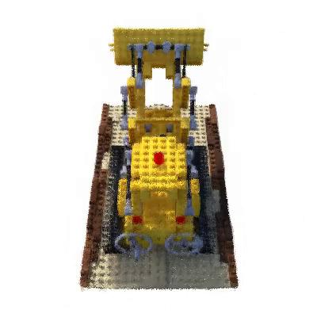

# TinyNeRF

### Setup a conda environment

- Conda env : [gsplat](../gsplat/README.md#setup-a-conda-environment)

---

## 1. Overview of Methods

<table>
	<tr>
		<th>NeRF Method</th>
		<th>Description</th>
		<th>Output Preview</th>
 	</tr>
 	<tr>
        <td><a href="./00_NERF.ipynb"><b>NeRF (Original, 2020)</b></a></td>
   		<td> 
            
 <b>- Core idea: </b> Neural network mapping (3D coords + viewing direction → color + density). 

            
 <b>- Pros: </b> Very high-quality novel view synthesis. 

            
 <b>- Cons: </b> Training takes days, rendering seconds per frame. 

        </td>
		<td>
        
        </td>
 	</tr>
	<tr>
        <td><a href="./01_FastNeRF.ipynb"> <b>FastNeRF (2021)</b></a></td>
   		<td> 
            
 <b>- Core idea: </b> Accelerate NeRF rendering. 

            
 <b>- Technique: </b> Decomposes MLP into two functions (position, view), caches results in lookup tables. 

            
 <b>- Pros: </b> Real-time rendering. 

            
 <b>- Cons: </b> High memory usage. 

        </td>
		<td>
        
        </td>
 	</tr>
	<tr>
        <td><a href="./02_KiloNeRF.ipynb"><b>KiloNeRF (2021)</b></a></td>
   		<td> 
            
 <b>- Core idea: </b> Speed up NeRF. 

            
 <b>- Technique: </b> Thousands of small MLPs (local regions). 

            
 <b>- Pros: </b> Parallelized fast rendering. 

            
 <b>- Cons: </b> Training complexity. 

        </td>
		<td>
        
        </td>
 	</tr>
	<tr>
        <td><a href="./03_PlenOctreesNeRF.ipynb"> <b>PlenOctrees (2021)</b></a></td>
   		<td> 
            
 <b>- Core idea: </b> Real-time rendering post-training. 

            
 <b>- Technique: </b> Converts NeRF into sparse octree with spherical harmonics. 

            
 <b>- Pros: </b> Extremely fast rendering. 

            
 <b>- Cons: </b> Needs conversion, not fully differentiable. 

        </td>
		<td>
        
        </td>
 	</tr>
    <tr>
        <td><a href="./04_PlenoxelsNeRF.ipynb"> <b>Plenoxels (2022)</b></a></td>
   		<td> 
            
 <b>- Core idea: </b> Fast training. 

            
 <b>- Technique: </b> Sparse voxel grid with spherical harmonics (no MLP). 

            
 <b>- Pros: </b> Training in minutes, competitive rendering. 

            
 <b>- Cons: </b> Memory-heavy. 

        </td>
		<td>
        
        </td>
 	</tr>
    <tr>
        <td><a href="./05_InfoNeRF.ipynb"> <b>InfoNeRF (2022)</b></a></td>
   		<td> 
            
 <b>- Core idea: </b> Few-shot / sparse input NeRF. 

            
 <b>- Technique: </b> Info-theoretic regularization (mutual information). 

            
 <b>- Pros: </b> Works with few images. 

            
 <b>- Cons: </b> Slower training. 

        </td>
		<td>
        
        </td>
 	</tr>
    <tr>
        <td><a href="./06_InstantNERF.ipynb"> <b>Instant NeRF (2022)</b></a></td>
   		<td> 
            
 <b>- Core idea: </b> Drastically accelerate. 

            
 <b>- Technique: </b> Multi-resolution hash encoding + tiny CUDA MLP. 

            
 <b>- Pros: </b> Training in seconds-minutes, real-time rendering. 

            
 <b>- Cons: </b> Specialized GPU implementation. 

        </td>
		<td>
        
        </td>
 	</tr>
    <tr>
        <td><a href="./07_K-plan_NERF.ipynb"> <b>K-Planes / K-Plan NeRF (2023)</b></a></td>
   		<td> 
            
 <b>- Core idea: </b> Scale to large / dynamic scenes. 

            
 <b>- Technique: </b> Scene partitioning with shared priors. 

            
 <b>- Pros: </b> Works for bigger, complex scenes. 

            
 <b>- Cons: </b> Pipeline complexity. 

        </td>
		<td>
        
        </td>
 	</tr>
    <tr>
        <td><a href="./08_FreeNERF.ipynb"> <b>FreeNeRF (2023)</b></a></td>
   		<td> 
            
 <b>- Core idea: </b> Sparse input robustness. 

            
 <b>- Technique: </b> Geometry regularization + self-distillation. 

            
 <b>- Pros: </b> Better with few input views. 

            
 <b>- Cons: </b> Not as high fidelity as dense NeRF. 

        </td>
		<td>
        
        </td>
 	</tr>
</table>

---

## 2. Comparison Table

| Variant             | Focus                | Speed | Memory | Training data needs | Notes |
|---------------------|----------------------|-------|--------|---------------------|-------|
| **NeRF (original)** | Quality baseline     | Slow  | Low    | Moderate            | Benchmark |
| **FastNeRF**        | Fast rendering       | Fast  | High   | Same as NeRF        | Lookup-heavy |
| **KiloNeRF**        | Fast rendering       | Fast  | Medium | Same as NeRF        | Many small MLPs |
| **PlenOctrees**     | Real-time rendering  | Very fast | Medium | Same as NeRF | Conversion needed |
| **Plenoxels**       | Fast training        | Fast  | High   | Same as NeRF        | No MLP |
| **InfoNeRF**        | Sparse input         | Slow  | Medium | Few-shot            | Info regularization |
| **Instant NeRF**    | Speed (train+render) | Very fast | Low   | Same as NeRF        | Hash encoding |
| **K-Planes**        | Large-scale scenes   | Medium| Medium | Many inputs         | Scene partitioning |
| **FreeNeRF**        | Sparse input         | Medium| Medium | Few-shot            | Self-distillation |

---

## 3. Timeline of Methods

- **2020** — NeRF (original) published. Baseline high-quality results, very slow.  
- **2021** — FastNeRF, KiloNeRF, PlenOctrees introduce **acceleration** methods.  
- **2022** — Plenoxels, InfoNeRF, Instant-NGP: focus on **faster training** and **sparse input robustness**.  
- **2023** — K-Planes, FreeNeRF, MM-NeRF: scaling to **larger scenes, sparse input, and multi-modal data**.  

---

## 4. Speed vs Quality Trade-off Visualization

The following scatter plot (from the accompanying notebook) shows approximate **relative trade-offs (1–10 scale)**:

- **X-axis = Speed (training+rendering).**
- **Y-axis = Quality (photorealism).**

*Note:* The numeric values for speed and quality are **relative approximations** for visualization purposes only, based on reported trends in the literature, not measured benchmarks.

Powered by ChatGPT

### Reference:

- ***Papers***:
    - **NeRF**: Representing Scenes as Neural Radiance Fields for View Synthesis [[arXiv]](https://arxiv.org/abs/2003.08934)
    - **FastNeRF**: High-Fidelity Neural Rendering at 200FPS [[arXiv]](https://arxiv.org/abs/2103.10380)
    - **KiloNeRF**: Speeding up Neural Radiance Fields with Thousands of Tiny MLPs [[arXiv]](https://arxiv.org/abs/2103.13744)
    - **PlenOctrees** for Real-time Rendering of Neural Radiance Fields [[arXiv]](https://arxiv.org/abs/2103.14024)
    - **Plenoxels**: Radiance Fields without Neural Networks [[arXiv]](https://arxiv.org/abs/2112.05131)
    - **InfoNeRF**: Ray Entropy Minimization for Few-Shot Neural Volume Rendering [[arXiv]](https://arxiv.org/abs/2112.15399)
    - **Instant** Neural Graphics Primitives with a Multiresolution Hash Encoding [[arXiv]](https://arxiv.org/abs/2201.05989)
    - **K-Planes**: Explicit Radiance Fields in Space, Time, and Appearance [[arXiv]](https://arxiv.org/abs/2301.10241)
    - **FreeNeRF**: Improving Few-shot Neural Rendering with Free Frequency Regularization [[arXiv]](https://arxiv.org/abs/2303.07418)

- ***Blog***:
    - ...

- ***Github***:
    - [Papers-in-100-Lines-of-Code](https://github.com/MaximeVandegar/Papers-in-100-Lines-of-Code/tree/main)