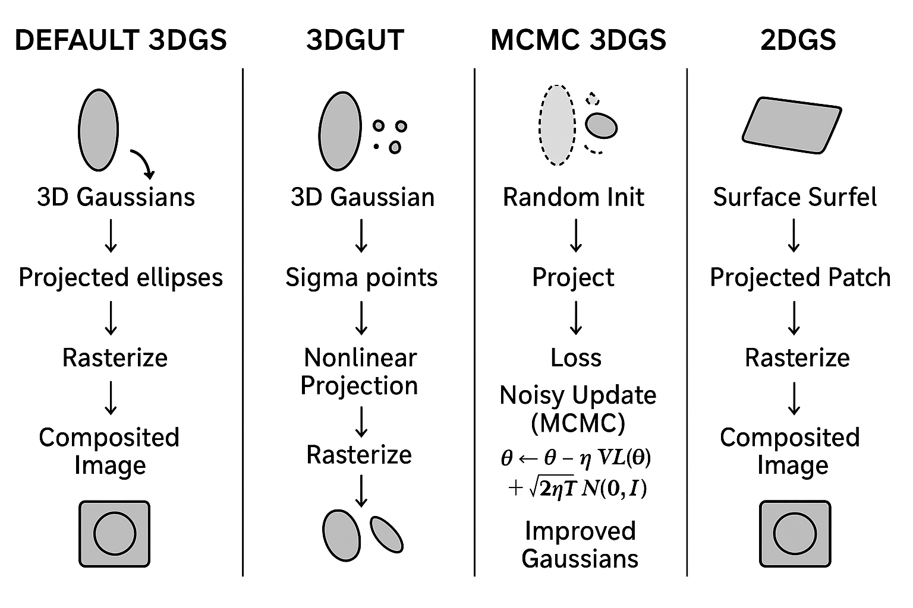

# 3D Gaussian Methods
---

## Baseline 3D Gaussian Splatting

* In 3DGS, the scene is represented as a set of 3D Gaussian primitives (each with position, covariance / scale, orientation, color, and opacity / density).
* These Gaussians are projected (or “splatted”) into the 2D image plane from a camera viewpoint, rasterized (often with EWA-style filtering / elliptical weights) and composited (e.g. α-blending) to yield pixel colors.
* The parameters of the Gaussians are optimized via gradient descent (or variants) to match a set of training views (multi-view images).
* To manage the capacity, 3DGS uses heuristic density control: it may **clone / split** Gaussians in high-error / high-detail regions, **prune** those with low opacity, or **reset** (lower opacity) in certain conditions.
* Initialization is often from an SfM / point cloud (e.g. via COLMAP), giving starting positions for Gaussians.
* The baseline 3DGS is efficient, enabling real-time rendering after optimization, and works well for many scenes, but has limitations: it is somewhat sensitive to initialization, and the heuristic density control may not generalize optimally across scenes.

The original 3D Gaussian Splatting behavior is described in the original paper and implementations (e.g. the Inria graphdeco repository) ([GitHub][1])

**Algorithm steps**

1. Initialize Gaussians from SfM/point cloud (position, covariance, color, opacity).
2. For each training iteration:

   * Project each 3D Gaussian → 2D ellipse using Jacobian linearization.
   * Rasterize splats in image plane (EWA filtering).
   * Composite with alpha blending.
   * Compute loss vs ground-truth image.
   * Backpropagate to update Gaussian parameters.
3. Densification heuristics:

   * Clone/split Gaussians in high-error regions.
   * Prune Gaussians with very low opacity.
   * Reset certain Gaussians if unstable.

**Diagram (conceptual)**

```
3D Gaussians  →  Projected Ellipses → Rasterize → Composited Image
(point cloud)        (2D splats)
```
---

## 3DGUT (3D Gaussian Unscented Transform)

**What it does / motivation**

3DGUT is a variant of Gaussian splatting that extends the baseline 3DGS to handle more general (nonlinear) camera projections and support **secondary rays / light effects** (e.g. reflections, refraction) while retaining rasterization efficiency. ([NVIDIA][2])

The core idea is to replace the usual EWA (elliptical weighted average) splatting rasterization with an **Unscented Transform (UT)** approximation of each Gaussian's projection. In effect:

* Instead of approximating the projection by a linearization (Jacobian) of the Gaussian's mapping to 2D, 3DGUT generates a set of sigma points that better approximate how a 3D Gaussian distributes after a nonlinear projection.
* These sigma points are projected exactly (or more faithfully) under arbitrary projection functions (e.g. fisheye, rolling shutter, distortions) and then used to reconstruct the 2D footprint / “splat” shape.
* This enables handling **distorted cameras, time-dependent camera effects, and non-pinhole models** more robustly than linear approximations.
* Additionally, they align the representation more closely to ray-tracing notions so that secondary rays (for reflection/refraction) can be combined within the same 3D Gaussian framework (e.g. discarding contributions behind intersections, compositing, then tracing secondary rays) ([arXiv][3])

**Algorithm steps**

1. Initialize Gaussians same as default.
2. For projection:

   * Generate sigma points (sampled positions around Gaussian center).
   * Project each sigma point exactly through *nonlinear* camera model.
   * Reconstruct the projected 2D footprint from these projected points.
3. Rasterize + composite as before.
4. Training loop is similar, but now robust to nonlinear camera effects.

**Diagram**

```
3D Gaussian → Sigma Points → Nonlinear Projection → 2D footprint → Rasterize
```

**Comparison / trade-offs**

| Aspect                                    | 3DGUT                                                                                           | Default 3DGS                                                                                      |
| ----------------------------------------- | ----------------------------------------------------------------------------------------------- | ------------------------------------------------------------------------------------------------- |
| Camera / projection support               | More flexible: supports nonlinear distortions (fisheye, rolling shutter)                        | Usually limited to ideal pinhole / simple projection (or requires custom Jacobians) ([NVIDIA][2]) |
| Accuracy of splatting under distortion    | Better, since sigma-point projection avoids linearization error                                 | May suffer from approximation errors when distortions are large                                   |
| Secondary rays / reflections & refraction | Can support them (hybrid approach) within the same Gaussian representation                      | Harder / not directly supported in default pipeline                                               |
| Computational overhead                    | Some overhead to compute sigma points and projection, but designed to remain efficient          | More lightweight in pure pinhole cases                                                            |
| Use cases                                 | Scenes captured with wide-angle / non-standard lens models, scenes with reflections/refractions | Standard scenes with pinhole cameras suffice                                                      |

So 3DGUT can be seen as a more general / robust variant especially for nonideal cameras or optical effects, trading a bit more complexity in the projection stage.

---

## MCMC (3DGS as Markov Chain Monte Carlo)

**What it does / motivation**

This approach — often referred to as “3D Gaussian Splatting as Markov Chain Monte Carlo (MCMC)” — reforms the training / optimization of Gaussians from a heuristic splitting/pruning process into a probabilistic sampling process. ([arXiv][4])

The key ideas:

1. **Interpret Gaussians as samples** from an implicit underlying probability distribution over plausible scene reconstructions.
2. Optimize via a **Stochastic Gradient Langevin Dynamics (SGLD)** or similar MCMC-type update, injecting noise into parameter updates to encourage exploration (i.e. avoid collapsing into bad local minima).
3. Reinterpret cloning / densification / pruning strategies as deterministic or probabilistic state transitions (e.g. relocalization) rather than heuristic rules.
4. Add regularizers (e.g. on opacity, scale) to encourage efficient use of Gaussians (i.e. removing unused ones) ([arXiv][4])
5. This probabilistic view reduces reliance on a “good initialization” (e.g. from an SfM point cloud) and improves robustness to initialization.

**Advantages / trade-offs**

* **Robustness to initialization**: Because the method encourages exploration (thanks to noise), it is less sensitive to how Gaussians are initially placed. Experimental results show that random initialization in MCMC-based 3DGS yields performance comparable to optimized initialization, whereas baseline 3DGS degrades under random initialization. ([NeurIPS Proceedings][5])
* **Cleaner / more principled splitting / pruning**: Heuristics are replaced by probabilistic or regularization-based decisions, making the method more interpretable and potentially more generalizable.
* **Higher quality in some scenarios**: Because it is less prone to getting stuck in poor local minima, the reconstructions may improve in challenging scenes.
* **Control over number of Gaussians**: Through regularization, the number of Gaussians can be controlled more directly.
* **Computational cost**: The MCMC approach incurs extra overhead (e.g. noise injection, sampling) and in the paper they note that a run with ~1 million Gaussians takes ~90 minutes, compared to ~30 minutes for baseline 3DGS on some scenes. ([OpenReview][6])
* **Convergence / mixing**: As in all MCMC methods, one must carefully calibrate noise and learning rates to balance exploration vs convergence — if the noise is too strong, the model may not settle.
* **Possible slower training**: Because of the stochasticity and sampling overhead, some training speed may be sacrificed.

Thus, the MCMC variant trades added complexity (and training cost) for better stability, less dependence on initialization, and more principled capacity control.

**Algorithm steps**

1. Initialize Gaussians (even randomly).
2. Training iterations:

   * Project & rasterize like default.
   * Compute image loss.
   * Update Gaussian parameters using **SGLD (stochastic gradient + noise)**:

     ```
     θ ← θ - η∇L(θ) + √(2ηT)·N(0, I)
     ```
   * Noise helps explore parameter space → avoid local minima.
3. Adaptation via probabilistic rules / regularizers (instead of heuristics):

   * Regularize opacity, scale → prune naturally.
   * Densify by sampling additional Gaussians when uncertainty is high.

**Diagram**

```
Random Init → Project → Loss → Noisy Update (MCMC) → Improved Gaussians
```

---

## 2DGS (“2D Gaussian Splatting”)

This is a more radical shift: instead of representing the scene with 3D Gaussian volumetric primitives, 2DGS represents it via **2D Gaussian surfels (surface elements)**. The idea is that many real-world scenes are more surface-dominated than volumetric, so modeling with 2D patches / splats can yield better geometric fidelity. ([arXiv][7])

**How it works**

* Each 2D Gaussian is essentially a small oriented “billboard” (a flat Gaussian patch) in 3D space, representing a local surface patch, rather than a volumetric blob.
* During rendering, these 2D Gaussians are projected / rasterized in a more conventional 2D splatting manner, but they encode geometry more accurately, avoiding some of the multi-view inconsistencies that volume-based 3D Gaussians may produce. ([arXiv][7])
* Because each splat lies on (or approximates) a surface, 2DGS can yield sharper geometry reconstructions, more precise surfaces, and potentially easier mesh extraction. ([surfsplatting.github.io][8])

**Limitations / challenges**

* **Aliasing / scale sensitivity**: 2DGS can suffer from aliasing artifacts when rendering at different sampling densities (e.g. zooming) because it lacks frequency control. A newer extension called **AA-2DGS (Anti-Aliased 2DGS)** addresses this by introducing world-space smoothing and a MIP-filter-like mechanism for each splat. ([arXiv][9])
* **Rendering fidelity trade-offs**: While geometry is more accurate, volumetric effects or subtle translucency may be harder to model, because you lose the “volume” expressivity of 3D Gaussians.
* **Compatibility and pipeline changes**: Because 2DGS is a different representation, one often needs custom renderers / tools instead of reusing 3DGS pipelines.
* **View consistency**: While 2DGS improves consistency across multi-view geometry, there may still be challenges in very steep view changes or occlusions.
* **Depth / normal ambiguity / specular surfaces**: Some works note that 2DGS struggles with glossy surfaces or discontinuities; one extension introduces **depth bias** to better handle specular reflection discontinuities. ([arXiv][10])

**Use cases / strengths**

* Scenes where surfaces dominate and volumetric “thickness” is minimal (e.g. most outdoor / architectural scenes)
* Where accurate geometry and mesh extraction are important
* Where view consistency across viewpoints is crucial

In short: 2DGS trades some of the volumetric flexibility of 3D Gaussians for sharper surfaces and geometric accuracy, with added challenges in aliasing, representation expressivity, and rendering robustness.

**Algorithm steps**

1. Represent scene with **oriented 2D surfel splats** (small patches).
2. Each splat has center, orientation, color, and 2D Gaussian footprint.
3. Rendering:

   * Project splats as flat Gaussians aligned with surface normal.
   * Blend results in screen space.
4. Optimization:

   * Adjust surfel parameters via gradient descent.
   * May refine / subdivide surfels for high-frequency detail.

**Diagram**

```
Surface Surfel (2D patch) → Projected Patch → Rasterize → Composited Image
```

---

## Summary & Comparative Highlights

Putting it all together, here’s a comparative summary across the four methods (Default 3DGS, 3DGUT, MCMC-3DGS, 2DGS):

| Method          | Representation           | Projection / Rasterization Strategy                                 | Density Control / Adaptation                                         | Strengths                                                                 | Weaknesses / Trade-offs                                                                                      |
| --------------- | ------------------------ | ------------------------------------------------------------------- | -------------------------------------------------------------------- | ------------------------------------------------------------------------- | ------------------------------------------------------------------------------------------------------------ |
| Default 3DGS    | 3D Gaussian (volumetric) | EWA / elliptical weighted rasterization with linearization          | Heuristic cloning, splitting, pruning, resets                        | Efficient, real-time, works well for many scenes                          | Sensitive to initialization, heuristics may not generalize                                                   |
| 3DGUT           | 3D Gaussian              | Use Unscented Transform + sigma-point projections                   | Similar adaptation (cloning/pruning) but better projection fidelity  | Supports nonlinear camera models, optical effects, more robust projection | More overhead in projection stage, more complexity                                                           |
| MCMC-based 3DGS | 3D Gaussian              | Similar rasterization, but training updates via stochastic sampling | Probabilistic / regularizer-driven adaptation rather than heuristics | Less sensitive to initialization, more principled adaptation, more robust | Slower training, extra complexity in hyperparameters / noise control                                         |
| 2DGS            | 2D Gaussian surfels      | Surface-based 2D splatting of oriented patches                      | Usually grows / prunes patches as needed                             | More accurate surfaces, better mesh extraction, view-consistency          | Aliasing, difficulty modeling volumetric effects, custom renderers, limitations in specular / shiny surfaces |

**When to choose which:**

* If your scene uses standard pinhole imagery, and you want a stable, well-understood baseline, default 3DGS is a good start.
* If you have nonstandard cameras (fisheye, rolling-shutter, distortions) or want to simulate reflections/refractions, 3DGUT is compelling.
* If initialization is unreliable or you want more robustness / fewer heuristics, the MCMC variant is attractive.
* If geometry accuracy, surface consistency, and mesh extraction are critical (e.g. for downstream 3D modeling), 2DGS (or a hybrid) may outperform purely volumetric 3D Gaussians.

[1]: https://github.com/graphdeco-inria/gaussian-splatting?utm_source=chatgpt.com "graphdeco-inria/gaussian-splatting - GitHub"
[2]: https://research.nvidia.com/labs/toronto-ai/3DGUT/?utm_source=chatgpt.com "3DGUT - Research at NVIDIA"
[3]: https://arxiv.org/abs/2412.12507?utm_source=chatgpt.com "3DGUT: Enabling Distorted Cameras and Secondary Rays in Gaussian Splatting"
[4]: https://arxiv.org/abs/2404.09591?utm_source=chatgpt.com "3D Gaussian Splatting as Markov Chain Monte Carlo - arXiv"
[5]: https://proceedings.neurips.cc/paper_files/paper/2024/file/93be245fce00a9bb2333c17ceae4b732-Paper-Conference.pdf?utm_source=chatgpt.com "[PDF] 3D Gaussian Splatting as Markov Chain Monte Carlo - NIPS papers"
[6]: https://openreview.net/forum?id=UCSt4gk6iX&utm_source=chatgpt.com "3D Gaussian Splatting as Markov Chain Monte Carlo - OpenReview"
[7]: https://arxiv.org/abs/2403.17888?utm_source=chatgpt.com "2D Gaussian Splatting for Geometrically Accurate Radiance Fields"
[8]: https://surfsplatting.github.io/assets/paper/paper.pdf?utm_source=chatgpt.com "[PDF] 2D Gaussian Splatting for Geometrically Accurate Radiance Fields"
[9]: https://arxiv.org/abs/2506.11252?utm_source=chatgpt.com "Anti-Aliased 2D Gaussian Splatting"
[10]: https://arxiv.org/abs/2503.06587?utm_source=chatgpt.com "Introducing Unbiased Depth into 2D Gaussian Splatting for High ..."

---

# ⚖️ Big-Picture Contrast

* **Default 3DGS** → Efficient, but relies on heuristics + good init.
* **3DGUT** → Same as 3DGS, but better projection (handles fisheye, rolling shutter, refraction).
* **MCMC 3DGS** → Same rendering, but training is probabilistic → robust to init.
* **2DGS** → Switches from volumetric Gaussians to surface patches → sharper geometry, harder volumetric effects.

---




---

 Powered by ChatGPT