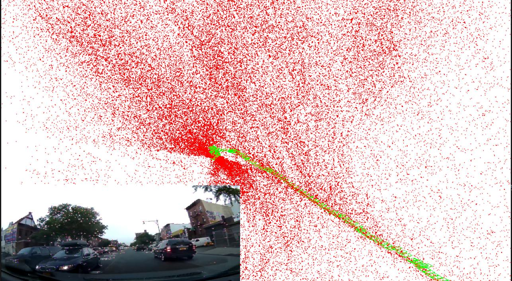

# Monocular Visual SLAM for Robotics Implementation in Python


----

- Juypter notebook : [slam_front_end_step_by_step.ipynb](./slam_front_end_step_by_step.ipynb)

- Python Demo : [main.py](./main.py) (Only for Ubuntu)


### Update the system for python demo

- **Install dependency:** For Ubuntu/Debian execute the below commands to install library dependencies,   

```
sudo apt-get install libglew-dev
sudo apt-get install cmake
sudo apt-get install ffmpeg libavcodec-dev libavutil-dev libavformat-dev libswscale-dev
sudo apt-get install libdc1394-22-dev libraw1394-dev
sudo apt-get install libjpeg-dev libpng-dev libtiff5-dev libopenexr-dev
```

- ***Install pangolin*** on the conda enviroment ([3dcv_playgrounds](../README.md#setup-a-conda-environment))
```
# pwd 
# ~/CV_Playgrounds/3DCV/Monocular_slam_front_end

conda activate 3dcv_playgrounds

git clone git@github.com:hyunjaeKang/pangolin.git temp_pangolin
cd temp_pangolin
mkdir build
cd build 
cmake -DBUILD_PANGOLIN_FFMPEG=OFF ..
cd ..
python setup.py install
```

 - **Run the demo code**
```bash
python main.py
```

----

### Reference:
 - https://learnopencv.com/monocular-slam-in-python/
 - https://github.com/spmallick/learnopencv/tree/master/Monocular%20SLAM%20for%20Robotics%20implementation%20in%20python