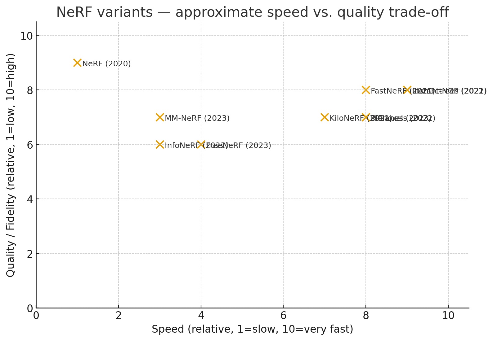

# NeRF Variants: Comparison, Timeline, and Trade-offs

This document summarizes different **Neural Radiance Field (NeRF)** variants, their goals, techniques, advantages, trade-offs, and relative placement in the **speed vs. quality trade-off space**.

---

## 1. Overview of Methods

### **NeRF (Original, 2020)**
- Core idea: Neural network mapping (3D coords + viewing direction → color + density).
- Pros: Very high-quality novel view synthesis.
- Cons: Training takes days, rendering seconds per frame.

### **FastNeRF (2021)**
- Goal: Accelerate NeRF rendering.
- Technique: Decomposes MLP into two functions (position, view), caches results in lookup tables.
- Pros: Real-time rendering.
- Cons: High memory usage.

### **KiloNeRF (2021)**
- Goal: Speed up NeRF.
- Technique: Thousands of small MLPs (local regions).
- Pros: Parallelized fast rendering.
- Cons: Training complexity.

### **PlenOctrees (2021)**
- Goal: Real-time rendering post-training.
- Technique: Converts NeRF into sparse octree with spherical harmonics.
- Pros: Extremely fast rendering.
- Cons: Needs conversion, not fully differentiable.

### **Plenoxels (2022)**
- Goal: Fast training.
- Technique: Sparse voxel grid with spherical harmonics (no MLP).
- Pros: Training in minutes, competitive rendering.
- Cons: Memory-heavy.

### **InfoNeRF (2022)**
- Goal: Few-shot / sparse input NeRF.
- Technique: Info-theoretic regularization (mutual information).
- Pros: Works with few images.
- Cons: Slower training.

### **Instant-NGP / Instant NeRF (2022)**
- Goal: Drastically accelerate.
- Technique: Multi-resolution hash encoding + tiny CUDA MLP.
- Pros: Training in seconds-minutes, real-time rendering.
- Cons: Specialized GPU implementation.

### **K-Planes / K-Plan NeRF (2023)**
- Goal: Scale to large / dynamic scenes.
- Technique: Scene partitioning with shared priors.
- Pros: Works for bigger, complex scenes.
- Cons: Pipeline complexity.

### **FreeNeRF (2023)**
- Goal: Sparse input robustness.
- Technique: Geometry regularization + self-distillation.
- Pros: Better with few input views.
- Cons: Not as high fidelity as dense NeRF.

### **MM-NeRF (2023)**
- Goal: Multi-modal inputs (e.g. LiDAR + RGB).
- Technique: Extended architecture for fusion.
- Pros: Better geometry and reconstruction.
- Cons: Needs more data, more complex.

---

## 2. Comparison Table

| Variant             | Focus                | Speed | Memory | Training data needs | Notes |
|---------------------|----------------------|-------|--------|---------------------|-------|
| **NeRF (original)** | Quality baseline     | Slow  | Low    | Moderate            | Benchmark |
| **FastNeRF**        | Fast rendering       | Fast  | High   | Same as NeRF        | Lookup-heavy |
| **KiloNeRF**        | Fast rendering       | Fast  | Medium | Same as NeRF        | Many small MLPs |
| **PlenOctrees**     | Real-time rendering  | Very fast | Medium | Same as NeRF | Conversion needed |
| **Plenoxels**       | Fast training        | Fast  | High   | Same as NeRF        | No MLP |
| **InfoNeRF**        | Sparse input         | Slow  | Medium | Few-shot            | Info regularization |
| **Instant NeRF**    | Speed (train+render) | Very fast | Low   | Same as NeRF        | Hash encoding |
| **K-Planes**        | Large-scale scenes   | Medium| Medium | Many inputs         | Scene partitioning |
| **FreeNeRF**        | Sparse input         | Medium| Medium | Few-shot            | Self-distillation |
| **MM-NeRF**         | Multi-modal inputs   | Slow  | Medium | More data           | Multi-sensor fusion |

---

## 3. Timeline of Methods

- **2020** — NeRF (original) published. Baseline high-quality results, very slow.  
- **2021** — FastNeRF, KiloNeRF, PlenOctrees introduce **acceleration** methods.  
- **2022** — Plenoxels, InfoNeRF, Instant-NGP: focus on **faster training** and **sparse input robustness**.  
- **2023** — K-Planes, FreeNeRF, MM-NeRF: scaling to **larger scenes, sparse input, and multi-modal data**.  

---

## 4. Speed vs Quality Trade-off Visualization

The following scatter plot (from the accompanying notebook) shows approximate **relative trade-offs (1–10 scale)**:

- **X-axis = Speed (training+rendering).**
- **Y-axis = Quality (photorealism).**

---

## 5. Sources (Representative Papers)

- NeRF (Mildenhall et al., 2020).  
- FastNeRF (Garbin et al., 2021).  
- KiloNeRF (Reiser et al., 2021).  
- PlenOctrees (Yu et al., ICCV 2021).  
- Plenoxels (Fridovich-Keil et al., CVPR 2022).  
- InfoNeRF (Kim et al., 2022).  
- Instant-NGP (Müller et al., 2022).  
- K-Planes (Fridovich-Keil et al., 2023).  
- FreeNeRF (Yang et al., CVPR 2023).  
- MM-NeRF (multi-modal NeRF, 2023).  

---

*Note:* The numeric values for speed and quality are **relative approximations** for visualization purposes only, based on reported trends in the literature, not measured benchmarks.
