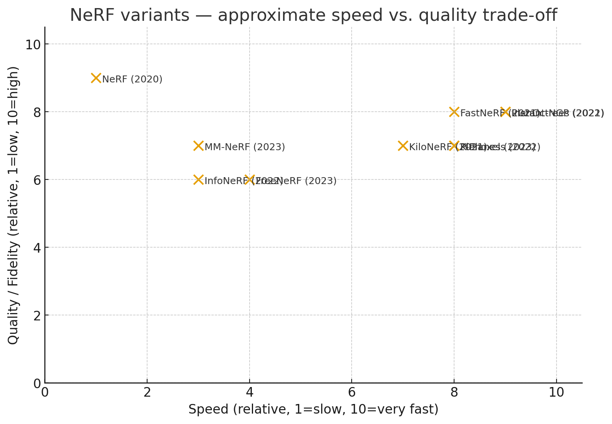

## Comparison Table

| Variant             | Focus                | Speed | Memory | Training data needs | Notes |
|---------------------|----------------------|-------|--------|---------------------|-------|
| **NeRF (original)** | Quality baseline     | Slow  | Low    | Moderate            | Benchmark |
| **FastNeRF**        | Fast rendering       | Fast  | High   | Same as NeRF        | Lookup-heavy |
| **KiloNeRF**        | Fast rendering       | Fast  | Medium | Same as NeRF        | Many small MLPs |
| **PlenOctrees**     | Real-time rendering  | Very fast | Medium | Same as NeRF | Conversion needed |
| **Plenoxels**       | Fast training        | Fast  | High   | Same as NeRF        | No MLP |
| **InfoNeRF**        | Sparse input         | Slow  | Medium | Few-shot            | Info regularization |
| **Instant NeRF**    | Speed (train+render) | Very fast | Low   | Same as NeRF        | Hash encoding |
| **K-Planes**        | Large-scale scenes   | Medium| Medium | Many inputs         | Scene partitioning |
| **FreeNeRF**        | Sparse input         | Medium| Medium | Few-shot            | Self-distillation |

---

## Timeline of Methods

- **2020** — NeRF (original) published. Baseline high-quality results, very slow.
- **2021** — FastNeRF, KiloNeRF, PlenOctrees introduce **acceleration** methods.
- **2022** — Plenoxels, InfoNeRF, Instant-NGP: focus on **faster training** and **sparse input robustness**.
- **2023** — K-Planes, FreeNeRF, MM-NeRF: scaling to **larger scenes, sparse input, and multi-modal data**.

---

## Speed vs Quality Trade-off Visualization

The following scatter plot (from the accompanying notebook) shows approximate **relative trade-offs (1–10 scale)**:

- **X-axis = Speed (training+rendering).**
- **Y-axis = Quality (photorealism).**

*Note:* The numeric values for speed and quality are **relative approximations** for visualization purposes only, based on reported trends in the literature, not measured benchmarks.

---

Powered by ChatGPT

